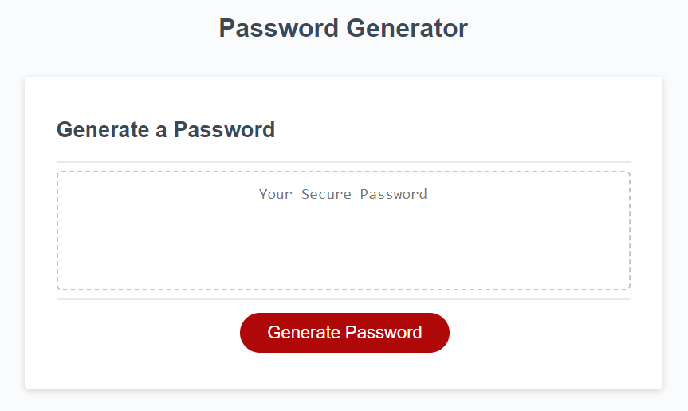

# Random Password Generator

## Description
This website's functionality is to generate a random password. The user is prompted to select criteria that will make up their generated password. These criteria are: Upper Case letters, Lower Case letters, Numbers, and Special Characters. Javascript is used to compute the logic for this activity. 

## Live Website
https://mariot573.github.io/Random-Password-Generator/

## Screenshot
